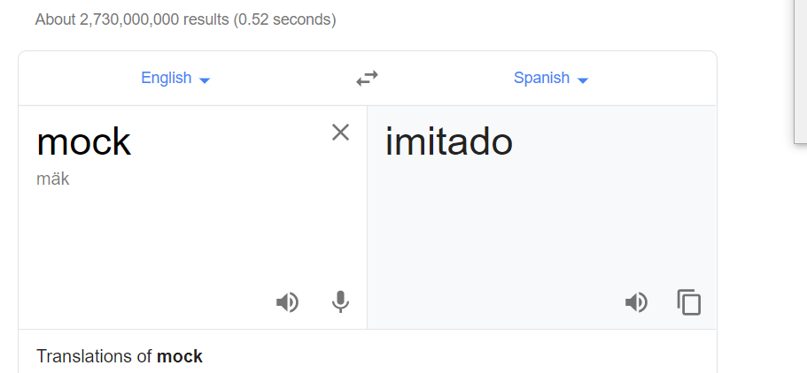
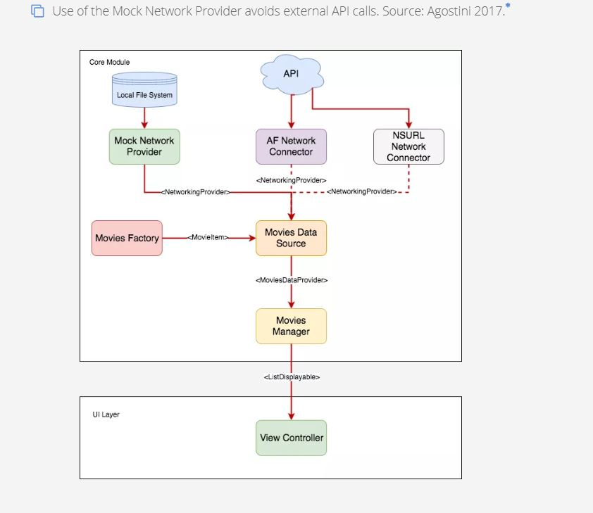
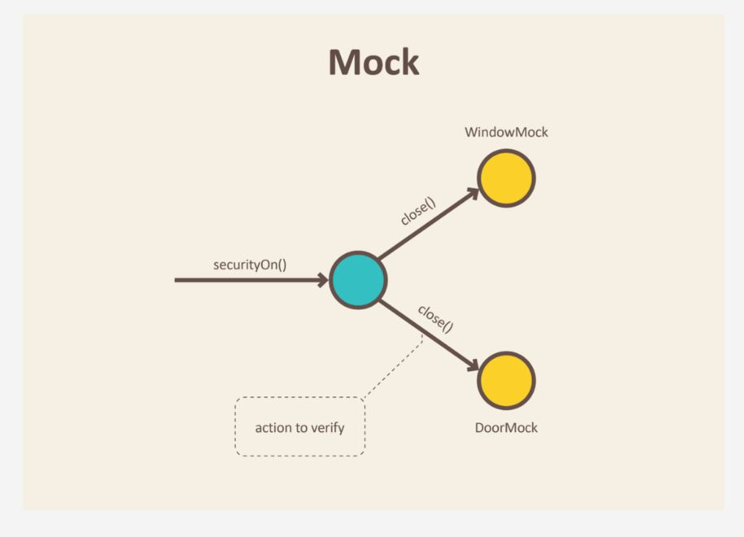

# Mock-testing (Prueba simulada)

[Mock testing - devopedia](https://devopedia.org/mock-testing)

Devopedia. 2019. "Mock Testing." Version 13, March 20. Accessed 2019-09-04. https://devopedia.org/mock-testing

Mock en español : burlarse de, mofarse de, imitar algo.

## Traducción

### Palabras Reservadas

## ¿Qué es es mock testing?

Mock testing, es un enfoque de test unitario que te permite realizar aserciones cómo el código por debajo del test está interactuando con otro sistema de módulos.

En Mock Testing (Comprobación imitando algo), las dependencias están remplazadas con objetos que simulan su comportamiento real.
El propósito del mocking (imitar algo) es de aislar y enfocarse en el código siendo comprobado y no en el comportamiento o el estado de las dependencias externas.
Mock testing is an approach to unit testing that lets you make assertions about how the code under test is interacting with other system modules. In mock testing, the dependencies are replaced with objects that simulate the behaviour of the real ones. The purpose of mocking is to isolate and focus on the code being tested and not on the behaviour or state of external dependencies.

Digamos, un servicio de notificación provoca que se envíe un email a través de un servicio. No queremos enviar correos cada vez que ejecutamos una comprobación de este servicio de notificación. Sin embargo, queremos verificar que el servicio de envío de correo es llamado. Tal servicio puede ser reemplazado con un objeto que imite esa caracteristica, o sea simulo que envío un correo al comprobar (testear) ese servicio de notificación.
Let's say, a notification service triggers an email service. We don't want to send emails each time we run a notification test. However, we want to verify that the email-sending service is called. Such a service can be replaced with a mock object.

## Discución

### ¿Dónde es útil la comprobación imitando algo?

Imitar algo es generalmente útil durante comprobaciones unitarias para que las dependencias externas ya no sean una restricción para la unidad o ese bloque de código que está a prueba.
Muchas veces estas dependencias pueden estar en desarrollo. Sin la comprobación imitando a estas dependencias, si un caso de prueba falla, sería bastante complicado saber si la falla se debe a nuestra prueba de código o se debe a depencias.
Mocking ,por lo tanto, acelera el desarrollo y la comprobación(test) al aislar las fallas.
Mocking is generally useful during unit testing so that external dependencies are no longer a constraint to the unit under test. Often those dependencies may themselves be under development. Without mocking, if a test case fails, it will be hard to know if the failure is due to our code unit or due to dependencies. Mocking therefore speeds up development and testing by isolating failures.

Otra razón para imitar el comportamiento de dependencias en los test is para evitar llamadas de red lentas o llamadas de APIS a terceros. Mocking(imitar algo) también habilita demostraciones y evaluaciones de productos.
Todas las unidades de un proyecto pueden progresar en paralelo sin esperar que todas estas unidades estén listas. Así, la comprobación (testing) pueden comenzar primero.
Other reasons to mock dependencies is to avoid slow network calls or call third-party APIs. Mocking also enables product demos and evaluations. All units of a project can progress in parallel without waiting for everyone to be ready. Thus, testing can start early.

Código que tiene efectos secundarios (colaterales) debe llamarse solo en producción. Los ejemplos incluyen cargar una tarjeta de crédito o enviar una notificación. Imitar el comportamiento de dependencias o burlarse (mocking) es útil para validar esas llamadas sin los efectos secundarios.
Code that have side effects should be called only in production. Examples include charging a credit card or sending a notification. Mocking is useful to validate such calls without the side effects.

Mocking avoids duplicating test code across similar tests. The task of verifying method or API calls from our module can be delegated to the mock.
Mocking avoids duplicating test code across similar tests. The task of verifying method or API calls from our module can be delegated to the mock.

### ¿ Nos puedes dar algunos ejemplos de mock testing?

Digamos, una clase de pedido, completa pedidos, llamando a una clase de almacén. El último sabe el inventario actual.
Si estamos probando la unidad de clase de pedido, burlaremos la clase de inventario. No nos preocupamos en probar la clase de almacén ahora mismo. Pero ya que es una dependencia de orden nos burlamos de él.
Nuestro objeto de burla puede ser llamado WarehouseMock;
Let's say, an Order class fulfils orders by calling a Warehouse class. The latter knows the current inventory. If we are unit testing Order class, we mock the Warehouse. We don't care about testing Warehouse right now. But since it's a dependency for Order, we mock it. Our mock object can be called WarehouseMock.

Un objeto de burla (Mock Object) proporciona una supuesta implementación de la misma interfaz como el objeto real.
Those calling it are unaware that it's a mock (Quienes lo llaman no saben que es un simulacro). Por lo tanto, para la clase pedido, WarehouseMock tiene el mismo aspecto que inventario. Esto es justo lo que necesitamos para comprobar de manera unitaria la clase pedido (testear).
A mock object provides a pseudo implementation of the same interface as the real object. Those calling it are unaware that it's a mock. Thus, to the Order class, WarehouseMock looks the same as Warehouse. This is just what we need to unit test Order class.

Otro ejemplo es sobre la aplicación que llama a un API externa para obtener información de películas. En lugar de realizar llamadas reales, estas pueden ser simuladas o burladas para que cuando la petición a la api se realice, el objeto simulado (mock object) simplemente lea y responda con datos de prueba de un sistema de archivos local.
Another example is about an application calling an external API to get information about movies. Instead of making real calls, this can be mocked so that when API calls are made, the mock object will simply read and respond with test data from a local file system.

### ¿El mocking requiere que los developers modifiquen su código base?

Si tu código utiliza objetos estáticos o singletons es más dificil hacer mocking. En tales casos es mejor hacer un refactor de código.
Por otro lado, de manera general, mocking no requiere que modifiques tu código base. De hecho, la inyección de dependencias es la manera usual de cómo esos objetos deberían ser creados. Las dependencias se vuelven visibles en el constructor y otros métodos. Éstas dependencias pueden, por lo tanto, ser fácilmente reemplazadas durante el proceso de testing con objetos simulados. Esto se puede configurar en código o mediante un archivo de configuración.
If your code uses static objects or singletons, then it's difficult to do mocking. In such cases, it's better to refactor code. Otherwise, in general, mocking doesn't require you to modify the codebase. In fact, dependency injection is the usual way in which objects should be created. Dependencies become visible in the constructors and other methods. These dependencies can therefore be easily replaced during testing with mock objects.  This can be configured either in code or via a configuration file.

### ¿Cuál es la diferencia del unit testing tradicional vs el mock testing?

En las pruebas unitarias tradicionales, las pruebas unitarias hacen afirmaciones sobre los estados esperados del sistema bajo prueba o de sus dependencias.
Con el test simulado, no se requieren comprobaciones de las pruebas unitarias.
Las comprobaciones son realizadas por el objeto simulado. Estos objetos son inicializados por adelantado sobre qué métodos esperan ser llamados y cómo deben responder.
In traditional unit testing, unit tests do assertions about states expected of either the system under test or its dependencies. With mock testing, no assertions are required from the unit tests themselves. Assertions are done by the mock objects. These objects are initialized in advance about what method calls are expected and how they should respond.

Mientras que las pruebas unitarias tienen más que ver con la verificación basada en el estado, las pruebas simuladas tienen más que ver con la verificación basada en el comportamiento.
Por ejemplo, asumamos, que la central de seguridad está siendo testeado. Depende de la puerta. Cuando la central de seguridad activa la seguridad total, unit testing verificará que el estado final de la puerta esté cerrada.
En cambio, el mocking verificará que el método correcto fue invocado con los argumentos esperados, como es el caso de Door.close(). Mocks registra las llamadas que recibe para que puedan afirmarse.
While unit tests are more about state-based verification, mock testing is more about behaviour-based verification. For example, let's assume that SecurityCentral is being tested. It depends on Door. When SecurityCentral activates full security, unit testing will verify the final state of Door, that it's closed. Mocking would instead verify that the correct method was invoked with expected arguments, such as Door.close(). Mocks register the calls they receive so these can be asserted.

### ¿Cuáles son los casos comunes de mock testing (prueba simulada) ?

- Prueba simulada en proxy, un objeto proxy es usado en lugar del objeto original.
In proxy-based mocking, a proxy object is used instead of the original object.
EL proxy puede manejar todas las llamadas hacia el objeto original o seleccionar enviar algunas llamadas.
The proxy may handle all calls to the original object or selectively 
forward some calls.

Herramientas que realizan las pruebas simuladas, como, EasyMock, JMock,Mockito ofrecen este tipo de simulación.
Mock frameworks such as EasyMock, JMock, Mockito offer this type of mocking.

Sin embargo, puede tener limitaciones en terminos de proxying static/private/ métodos finales o una clase final.
However, there may be limitations in terms of proxying static/private/final methods or a final class.

- Prueba simulada basada en classloader-remapping, una cargador de clases reasigna la referencia.
In classloader-remapping-based mocking, a class loader remaps the reference.

Por lo tanto, cargará el objeto simulado en vez que el original. Herramienta de simulación como JMockit and PowerMock lo soportan
Thus, it loads the mock object rather than the original one. Mock frameworks such as JMockit and PowerMock support this. 

Este tipo supera los limites de las pruebas simuladas basadas en proxy.
This overcomes the limits of proxy-based mocking.

En el lenguaje Swift, un desarrollador escribió en su blog que usa dos formas de pruebas simuladas : Inyección de instancia y configuración de inyección. El primero es el mas simple pero no puede manejar objetos estáticos.
In Swift language, one developers blogged that he uses two ways to do mocking: instance injection and configuration injection. The former is simpler but it can't handle static objects.

### ¿Cuáles son las mejores prácticas para pruebas simuladas?

What are some best practices for mock testing?

Aquí algunas buenas pràcticas para pruebas simuladas.
Here are some best practices for mocking.

- Solo simula los tipos que tienes
- Only mock types that you own

Tipos externos tienen sus propias dependencias. Estas incluso pueden cambiar su comportamiento en una versión futura.
External types have dependencies on their own. They might even change their behaviour in a future version.
En su lugar, crea un adaptador y simule ese adaptador.
Instead, create an adapter and mock that adapter.

- No simule valores
- Don't mock values

Los valores no deberían ser simulados. La simulación tiene como objetivo hacer visible las relaciones e interacciones entre los objetos. Obtener un valor no es una interacción.
Values should not be mocked. Mocking aims to make the relationships and interactions between objects visible. Getting a value is not an interaction.

- Evita simular clases concretas
- Avoid mocking concrete classes

Las relaciones son fáciles de ver a través de interfaces en lugar de clases concretas. Podríamos terminar del todo simulando algunos métodos pero olvidando otros. Simula roles, no objetos.

Relationships are easier to see via interfaces rather than concrete classes. We might end up mocking some methods but forget others. Mock roles, not objects.

- No simules todo
- Don't mock everything
Esto es un anti-patrón. Si todo está simulado, podríamos terminar del todo probando algo bastante diferente del sistema en producción.
This is an anti-pattern. If everything is mocked, we may end up testing something quite different from production system.

- Utiliza pruebas integradas
- Use integration tests

Cuando compruebas multiples módulos o si estás interesado en data que proviene de una base de datos externa, deberías hacer test integrados en lugar de simular.
When testing multiple modules or if you're interested in data coming from an external database, you should do integration testing rather than mocking

- Comprobaciones negativas
- Negative tests

Usa las imitaciones para simular errores y comprobar manejadores de errores. Utiliza las imitaciones para verificar que algún método/API no se llama.
Use mocks to simulate errors and test error handling. Use mocks to verify that some methods/APIs are not called.

### ¿Cuáles son algunos frameworks para hacer pruebas simuladas?

What are some mocking frameworks?

Mientras que es posible escribir objetos simulados de manera manual, los frameworks simplifican esta tarea.
[Mockito](https://site.mockito.org/) es un framework de código abierto para hacer pruebas con Java. Se afirma que es uno de los más populares.

While it's possible to manually write mock objects, mocking frameworks simplify the task. Mockito is an open source testing framework for Java. Mockito is claimed to be the one of the popular ones.

JustMock and MOQ package are useful for .NET developers. . There's also JustMock Lite when dealing with loosely coupled code. Wiremock is suitable for mocking HTTP-based APIs.

For C++ developers, there's TypeMock and Google Mock. The latter is part of GoogleTest. TypeMock uses a templating approach to create mocks whereas Google Mock uses interitance.

Other frameworks include EasyMock, JMock, JMockit, and PowerMock. Ease of use, maintainability and learning curve are some things to consider when choosing a framework.